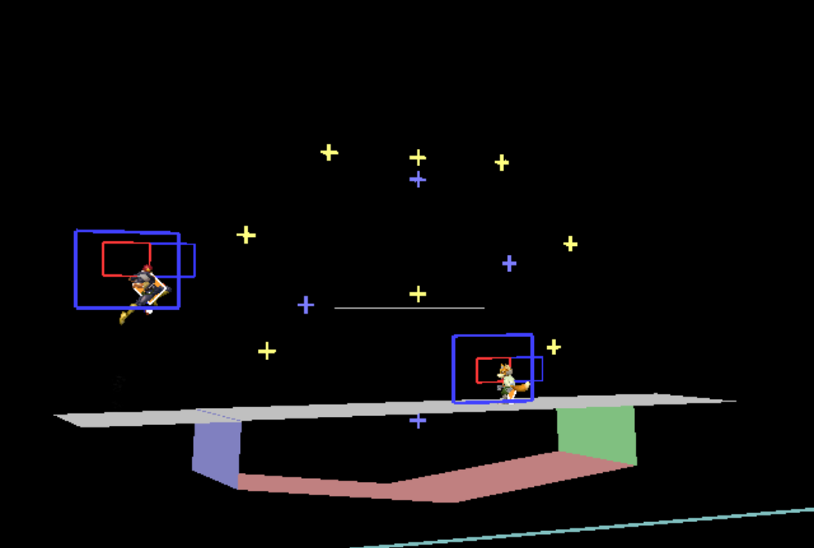

# Notes
I don't guarantee anything with these stages. However, some people may find them interesting. They are mostly concept tests for stages I have either not been able to begin work on yet, or concepts I have not been able to flesh out yet.

## GrGd Underwater Concept Test
Japes' water will still affect players standing on platforms.

## GrOk (0.8 scaling)

Suddenly this stage is very different, and still playable. I think it could be better, still.

## GrOy Ledge Experiment

This stage breaks running even when the side platforms are perfectly aligned. Try dashing from the center of the stage to the clouds. Interestingly, the inner ledges are not grabbable until the side platforms disappear.

## GrTLk LinkerWall Demo
Functional test for whether a floating wall works decently in a stage. There is a huge wall in the center of this stage that players can't land on. This stage ended up as "Wanderer's Wall" which you can find in the stages folder.