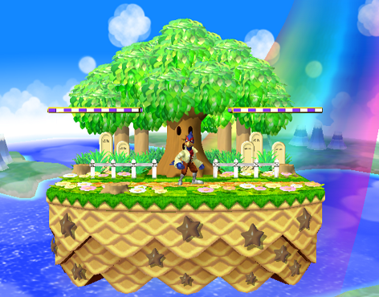
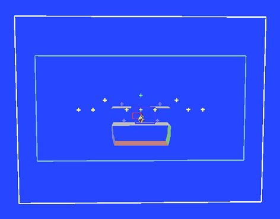

# Notes
This stage is really fun. The ledges have small slopes, and many characters can Doraki (not Fox, though). The blast height is even lower than Yoshi's Story, but without a top platform, it doesn't feel like it.

# Current Changes
* Blast height: 197 -> 222
* Camera height: 126 -> 142
* Camera zoom minimum: 83 -> 124
* P3 spawn position: (-100,-3) -> (40,42)
* P4 spawn position: (100,-3) -> (-40,42)
* Side stage elements moved off-screen. Corresponding collision removed.
* Blocks & wind disabled.

# To-do
* More testing for full release
* Create Gecko implementation of this stage.