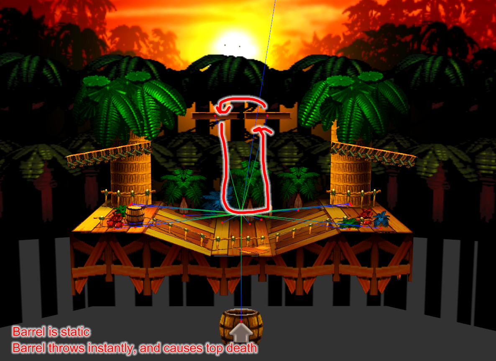

# Notes
This stage is nowhere near complete. However, you can still try it out to get an idea of what I'm going for.

Rather than removing the barrel, I tried to fix what people might consider bad behavior from the barrel. The random rotation and position are removed and the barrel won't give you a second lease on life. 

The barrel blast strength has been upped enough to kill every character off the top of the screen. If you have a teammate, however, they might be able to save you.

This stage is primarily meant for 2v2 gameplay.

# Current Changes
* Barrel does not move
* Barrel positioned underneath center of stage
* Barrel releases characters instantly upon capturing them
* Barrel deals 30% when releasing a character
* Barrel will throw all characters far enough to kill them off the top
* Side platforms lowered by 20 units

# To-do
* Make the stage look acceptable without the visuals hack
* Fix erratic barrel behavior
* Add ceiling collision to most of the stage underside
* More testing, especially blast zones...