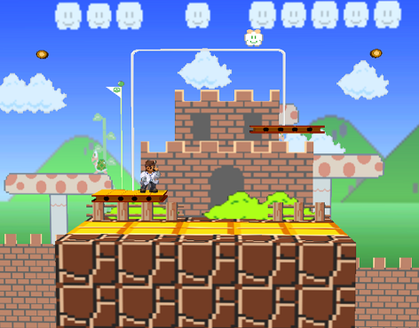
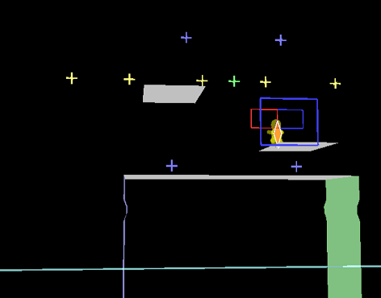

# Notes
The platforms have the same weight scale behavior that they do on the vanilla stage. When the platform gets down to the ground, both platforms will fall and disappear for a few seconds.

This stage also has some non-obvious geometry on the walls in order to prevent C.Falcon from auto-walljumping every time he grabs the ledge. He can still Doraki.

# Current Changes
* Blocks moved off-screen
* Side stage elements removed along with their collision
* Center platform width increased
* Balance platforms moved inwards and upwards
* Balance platform falloff height moved to match ground height
* Balance platform restoration time reduced
* Wall geometry changed to accomodate C.Falcon bug

# To-do
* Fix spawn locations
* Fix camera
* Fix ledge visibility
* Fix graphical errors
* More testing for full release
	* Platform respawn time?
* Create Gecko implementation of this stage.