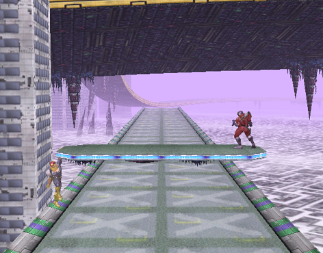

# USE THIS CODE!

```
Mute City - Disable Cars (1.02)[flieskiller]
041f0188 60000000
```



# Changes
* Ledges added to main platform
* Cars disabled via Gecko code

# To-do
* Fix camera in tunnel
	* Probably need to remove tunnel object as well.
* Solve issue with ledge grabs during transformations
	* Transport the main platform further?
	* Disable ledge grabs during transformations?
	* Disable platform during transformations?
* Flatten ground during transformations 1, 2, and 5
