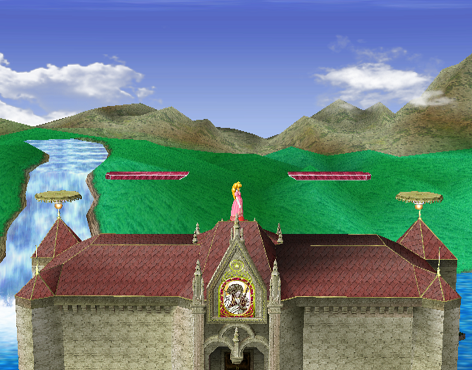
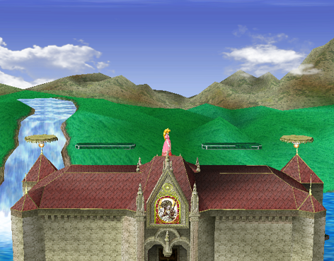
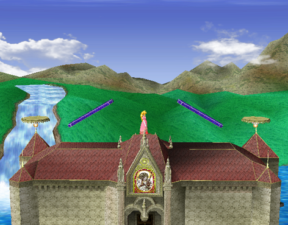
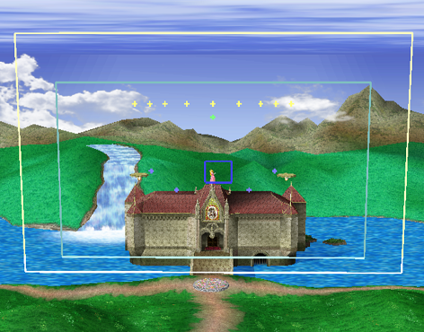

# Notes
There are three transformations based on which button was last hit. Randomly colored buttons will spawn on the stage in a random location when there are no colored platforms active. I've moved the default platforms near the edge to try and mitigate any problems the extreme slope causes.

This stage is pretty fun, but it can take a really long time to play out four stocks. It might be better suited for teams.

# Current Changes
* Center structure lowered
* Banzai Bills come far, far less frequently
* Buttons no longer give hitlag
* Button locations are entirely on the stage
* Colored blocks removed
* Colored platforms rearranged
* Platforms last for much longer

# To-do
* Fix the Banzai Bill problem
* Fix the camera
* Fix troublesome rising side platforms
* Fix spawn locations
* More testing...