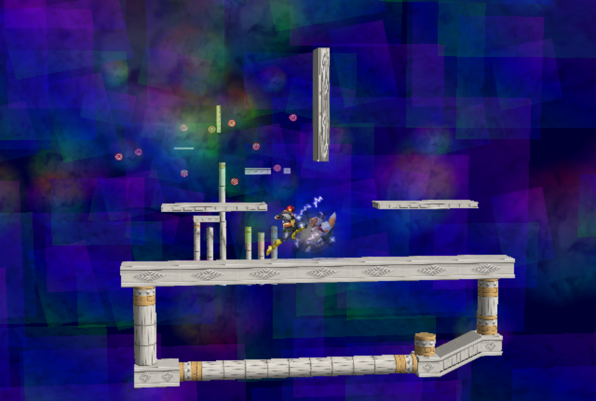
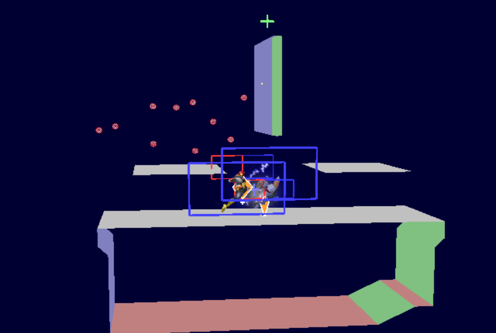

# Notes
This stage has an obvious wall between the two side platforms, drastically affecting combos and strategy. I've thought about lots of scenarios where the wall can really break gameplay, and I actually think this stage could be as competitive as typical tri-plat stages. The top end of the wall is slightly too high for any character to be able to get over it without using their double jump, and the low end is placed to not interfere with what most people would consider 'normal' gameplay. If you're just doing aerials and dash dancing around on the ground, you usually don't have to worry about the wall screwing things up.

The side platforms are also quite low on this stage, creating an agressive and chaotic dynamic. There are lots of interesting tricks with momentum and hitstun that we don't normally get to see in Melee. It's fun!

This stage was conceived of in the Creative Melee Discord by The Wanderer and PGH Carroll. A lot of playtesting was done there. I'm the one that tuned the design with regards to competitive play. Currently, the Creative Melee Discord is collaborating to create a unique visual look for the stage. Look out for it!

There is a known glitch where Peach (maybe others) gets stuck *in* the wall and rapidly bounces back and forth. If you come across this glitch and think you can help fix it please get in contact with me!

# To-do
* Fix the Peach bouncy glitch somehow...
* Get items working properly
* Convert to Gecko code...